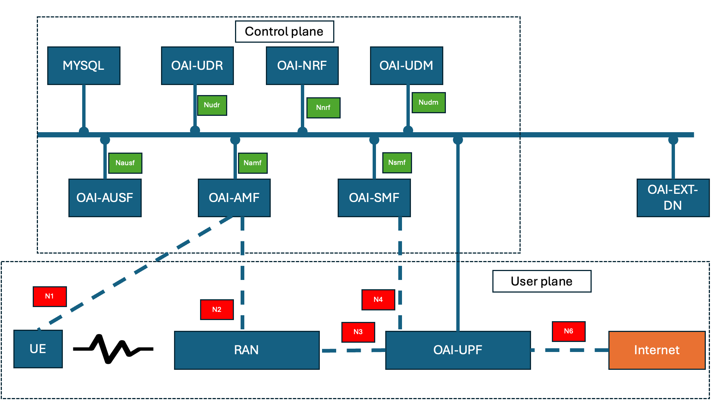

# OAI 5G Core Network Topology

Service Based Interfaces (SBIs) (i.e. interfaces that are labeled `Nxxx`), are used in the Control Plane in the 5G Network to connect between different Network Functions.
All Network Functions in the Control Plane in the 5G Network, are using a common bus to exchange control plane messages between each other.
Each Network Function is using a Service Based Interface (SBI), in order to connect to this common bus.

## In detail for the core:

 - **MYSQL**: 
	 - image: mysql:8.0
	 - build file: https://github.com/docker-library/mysql/blob/090eb25ac69bca920fc5320484bc35aac92a8143/8.0/Dockerfile.oracle
	 - It is needed for the `oai-udr` network function. Not part of a typical 5G core.
 - **oai-udr**: 
	 - image: oaisoftwarealliance/oai-udr:v2.1.0
	 - source: https://gitlab.eurecom.fr/oai/cn5g/oai-cn5g-udr/-/tree/v2.1.0?ref_type=tags
 - **oai-ausf**
	 - image: oaisoftwarealliance/oai-ausf:v2.1.0
	 - source: https://gitlab.eurecom.fr/oai/cn5g/oai-cn5g-ausf/-/tree/v2.1.0?ref_type=tags
 - **oai-nrf**:
	 - image: oaisoftwarealliance/oai-nrf:v2.1.0
	 - source: https://gitlab.eurecom.fr/oai/cn5g/oai-cn5g-nrf/-/tree/v2.1.0?ref_type=tags
 - **oai-amf**
	 - image:  oaisoftwarealliance/oai-amf:v2.1.0
	 - source: https://gitlab.eurecom.fr/oai/cn5g/oai-cn5g-amf/-/tree/v2.1.0?ref_type=tags
 - **oai-upf**
	 - image: oaisoftwarealliance/oai-upf:v2.1.0
	 - source: https://gitlab.eurecom.fr/oai/cn5g/oai-cn5g-upf/-/tree/v2.1.0?ref_type=tags
- **oai-ext-dn**:
	 - image: oaisoftwarealliance/trf-gen-cn5g:latest
	 - source: https://gitlab.eurecom.fr/oai/cn5g/oai-cn5g-fed/-/blob/v2.1.0/ci-scripts/Dockerfile.traffic.generator.ubuntu?ref_type=tags
	 - It is just a traffic generator. It is not needed in the core.
 - **oai-smf**
	 - image: oaisoftwarealliance/oai-smf:v2.1.0
	 - source: https://gitlab.eurecom.fr/oai/cn5g/oai-cn5g-smf/-/tree/v2.1.0?ref_type=tags
 - **oai-udm**
	 - image: oaisoftwarealliance/oai-udm:v2.1.0
	 - source: https://gitlab.eurecom.fr/oai/cn5g/oai-cn5g-udm/-/tree/v2.1.0?ref_type=tags

## In detail for the RAN 

- source: [https://gitlab.eurecom.fr/oai/openairinterface5g](https://gitlab.eurecom.fr/oai/openairinterface5g)
- We use the latest weekly tag. Latest version we tested `2024.w15`.
- We modify some parameters like MCC / MNC and IP addresses.

